## Mermaid ERD Creation Guide

Entity Relationship Diagrams (ERDs) visualize database schemas and relationships between entities. Use Mermaid syntax for all ERD diagrams in this project.

---

## Basic Syntax

### Minimal ERD Example

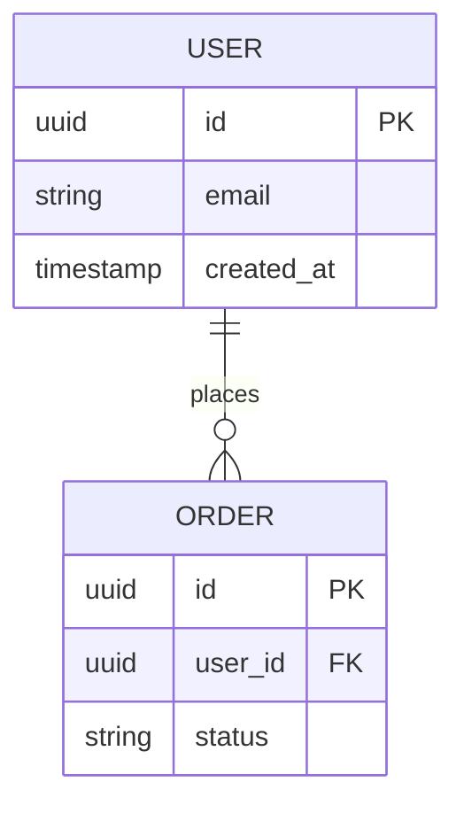

### Entity Declaration

**Format:** `ENTITY_NAME { }`

Rules:
- Entity names in UPPERCASE (e.g., `USER`, `ORDER`, `PAYMENT`)
- Use singular nouns (USER not USERS)
- Avoid abbreviations unless industry-standard (e.g., `OAUTH_TOKEN` is fine)

### Field Declaration

**Format:** `type name constraint`

**Components:**
1. **Type** - Data type (string, int, uuid, timestamp, boolean, decimal, text, json)
2. **Name** - Field name in snake_case
3. **Constraint** - PK (primary key), FK (foreign key), UK (unique key), or empty

**Examples:**
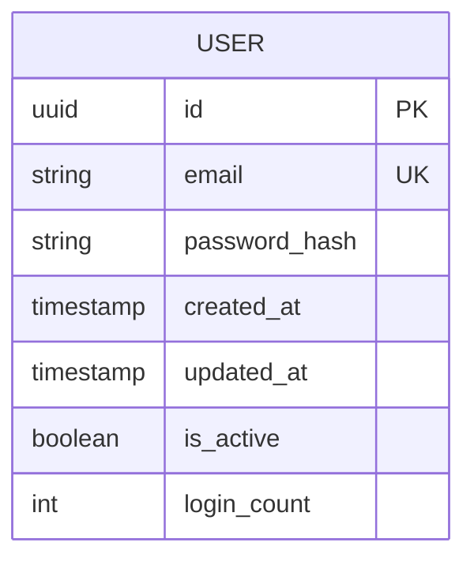

### Relationship Declaration

**Format:** `ENTITY_A CARDINALITY ENTITY_B : "relationship_label"`

**Cardinality Symbols:**
- `||--||` : Exactly one to exactly one
- `||--o|` : Exactly one to zero or one
- `||--o{` : Exactly one to zero or many
- `}o--o{` : Zero or many to zero or many
- `}|--|{` : One or many to one or many

**Reading Relationships:**
- `||` = exactly one
- `o|` = zero or one
- `o{` = zero or many
- `|{` = one or many

---

## Relationship Types Explained

### One-to-One (1:1)

**Use case:** Extension tables, profile data

**Syntax:** `||--||`

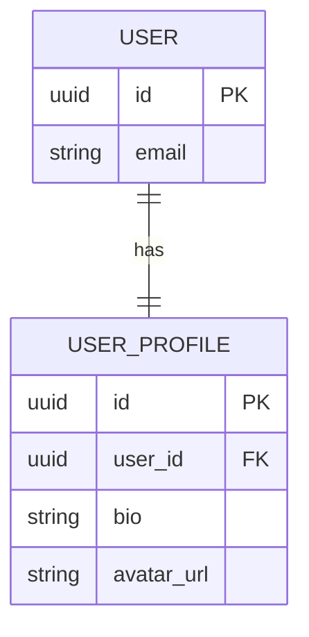

**When to use:**
- Each user has exactly one profile
- Splitting large tables for performance
- Separating frequently vs rarely accessed data

---

### One-to-Many (1:N)

**Use case:** Most common relationship type

**Syntax:** `||--o{` (one to zero-or-many)

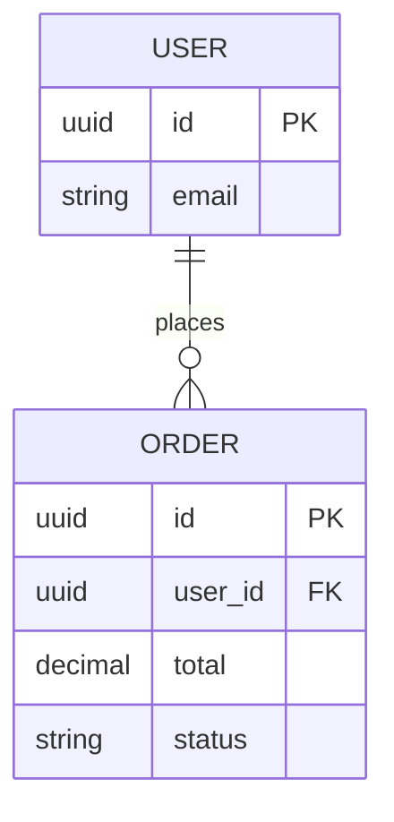

**Reading:** "One USER places zero or many ORDERS"

**When to use:**
- Parent-child relationships
- Ownership (user owns posts, orders, etc.)
- Hierarchical data

---

### Many-to-Many (N:M)

**Use case:** Multiple associations in both directions

**Syntax:** `}o--o{` (zero-or-many to zero-or-many)

**IMPORTANT:** Requires junction table

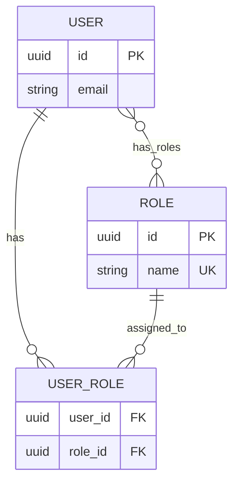

**When to use:**
- Users have multiple roles, roles have multiple users
- Products in multiple categories, categories have multiple products
- Students enrolled in courses, courses have multiple students

**Best Practice:** Always create explicit junction table

---

## Complete Example: E-Commerce System

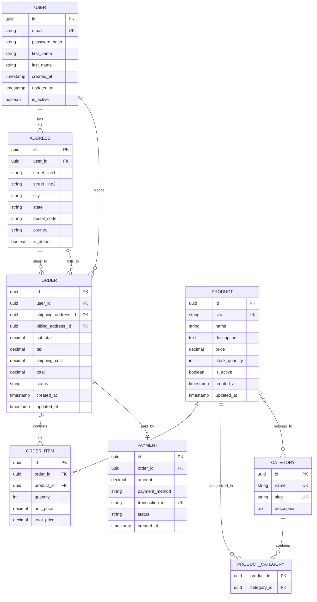

---

## Advanced Patterns

### Self-Referencing Relationships

**Use case:** Hierarchies (org charts, comment threads)

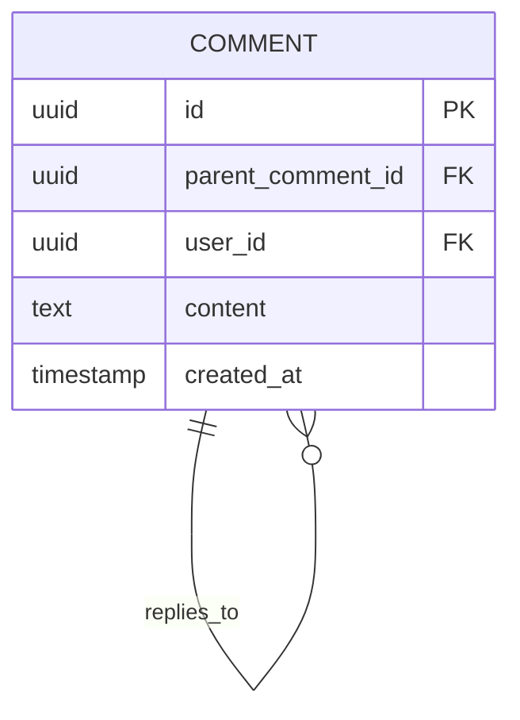

**Reading:** "A COMMENT can have zero or many child COMMENTS"

---

### Polymorphic Relationships

**Use case:** Comments on multiple entity types

**Approach 1: Separate junction tables (recommended)**

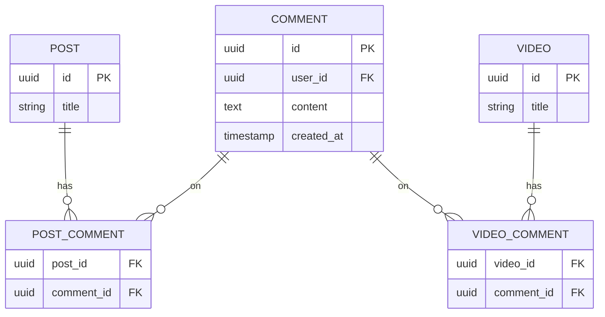

**Approach 2: Type discriminator (not recommended)**

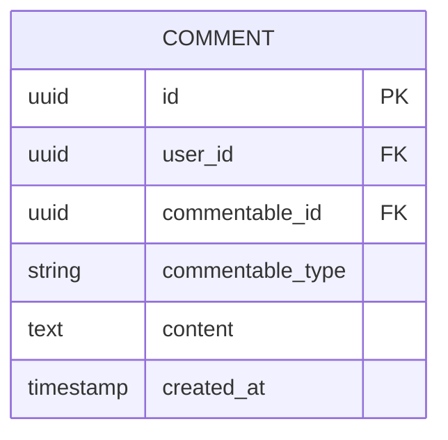

**Problem:** Can't use foreign key constraints, breaks referential integrity.

---

## Naming Conventions

### Entity Names
- **Use:** UPPERCASE, singular nouns
- **Examples:** USER, ORDER, PRODUCT, PAYMENT
- **Avoid:** USERS (plural), user (lowercase), Usr (abbreviation)

### Field Names
- **Use:** snake_case
- **Examples:** user_id, created_at, email_verified, password_hash
- **Avoid:** userId (camelCase), USERID (uppercase), usrID (abbreviation)

### Relationship Labels
- **Use:** Verb phrases describing the relationship
- **Examples:** "places", "has", "belongs_to", "ships_to", "paid_by"
- **Avoid:** Vague labels like "related", "associated", "linked"

---

## Common Patterns

### Timestamps (Audit Fields)

**Always include:**
```
timestamp created_at
timestamp updated_at
```

**Optional (for soft deletes):**
```
timestamp deleted_at
```

---

### Soft Deletes

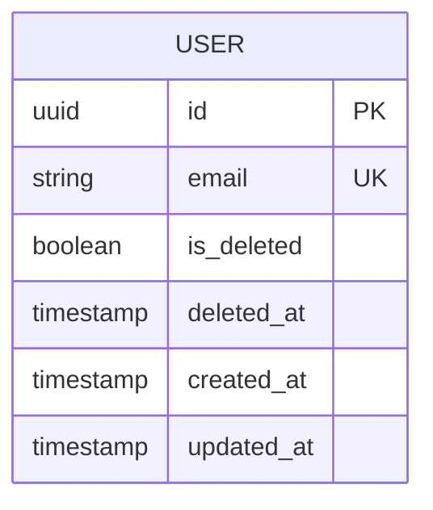

**When to use:**
- Regulatory requirements (data retention)
- Audit trails needed
- Undelete functionality required

---

### Versioning

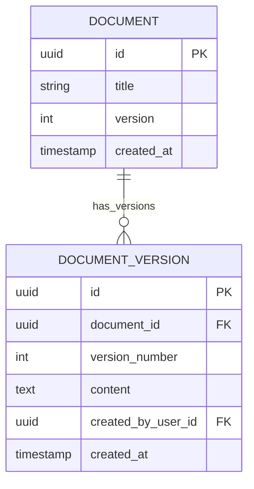

---

## Best Practices

### 1. Always Define Primary Keys
**Good:**
```
USER {
    uuid id PK
    string email
}
```

**Bad:**
```
USER {
    string email
}
```

### 2. Use Meaningful Foreign Key Names
**Good:**
```
ORDER {
    uuid id PK
    uuid user_id FK
    uuid shipping_address_id FK
}
```

**Bad:**
```
ORDER {
    uuid id PK
    uuid fk1 FK
    uuid fk2 FK
}
```

### 3. Include Relationship Labels
**Good:**
```
USER ||--o{ ORDER : "places"
```

**Bad:**
```
USER ||--o{ ORDER : ""
```

### 4. Document Constraints
Use `UK` for unique constraints:
```
USER {
    uuid id PK
    string email UK
}
```

### 5. Be Explicit About Optionality
- Use `||--o{` for "zero or many" (optional)
- Use `||--|{` for "one or many" (required)

---

## Common Mistakes

### Mistake 1: Forgetting Junction Tables

❌ **Wrong:**
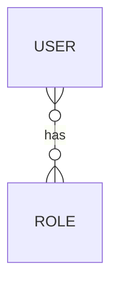

✓ **Correct:**
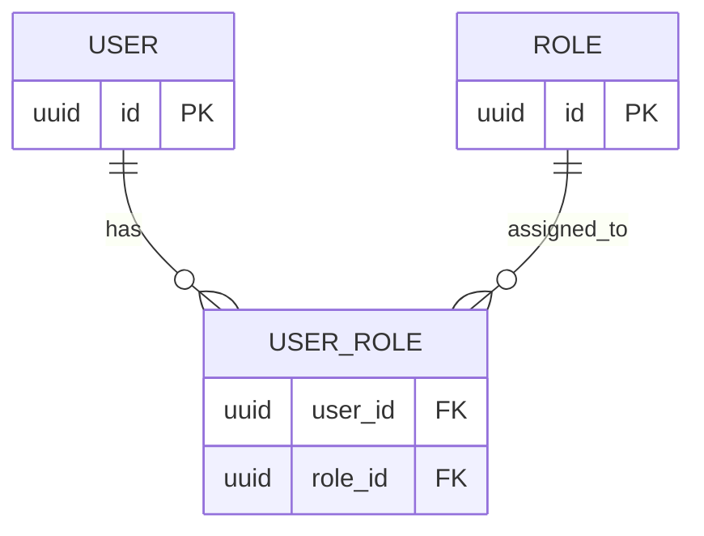

---

### Mistake 2: Wrong Cardinality

❌ **Wrong:** User has exactly one order
```
USER ||--|| ORDER : "places"
```

✓ **Correct:** User has zero or many orders
```
USER ||--o{ ORDER : "places"
```

---

### Mistake 3: Missing Foreign Keys

❌ **Wrong:**
```
ORDER {
    uuid id PK
    uuid user_id
}
```

✓ **Correct:**
```
ORDER {
    uuid id PK
    uuid user_id FK
}
```

---

### Mistake 4: Plural Entity Names

❌ **Wrong:**
```
USERS {
    uuid id PK
}
```

✓ **Correct:**
```
USER {
    uuid id PK
}
```

---

## When to Use ERDs

### Always Use For:
1. **Data model design phase** - Before writing any schema code
2. **Schema migrations** - Visualize changes before implementing
3. **Documentation** - Include in architecture docs, ADRs
4. **Stakeholder communication** - Non-technical reviewers need visuals

### Update ERDs When:
1. Adding new entities
2. Adding/removing relationships
3. Changing cardinality (1:1 → 1:N)
4. Adding significant fields (foreign keys, unique constraints)

### Don't Bother For:
1. Adding simple fields to existing entities (unless FK)
2. Index-only changes (ERD shows logical schema, not physical)
3. Minor data type changes

---

## Integration with Data Model Design Process

### Step 1: Discovery (use data-model-discovery skill)
Ask questions about entities, relationships, query patterns.

### Step 2: ERD Creation (this skill)
Create visual diagram of entities and relationships.

### Step 3: Schema Definition
Translate ERD to SQL/ORM schema:

```sql
CREATE TABLE users (
    id UUID PRIMARY KEY,
    email VARCHAR(255) UNIQUE NOT NULL,
    created_at TIMESTAMP NOT NULL DEFAULT NOW()
);

CREATE TABLE orders (
    id UUID PRIMARY KEY,
    user_id UUID NOT NULL REFERENCES users(id),
    total DECIMAL(10, 2) NOT NULL,
    created_at TIMESTAMP NOT NULL DEFAULT NOW()
);
```

### Step 4: Review
Validate ERD against:
- Normalization rules (3NF typically)
- Query patterns (denormalize if needed)
- Performance requirements (indexes)

---

## Tools & Rendering

### Rendering Options
1. **Mermaid Live Editor** - https://mermaid.live
2. **GitHub/GitLab** - Auto-renders in markdown
3. **VS Code** - Mermaid preview extensions
4. **Documentation sites** - Sphinx, MkDocs with mermaid plugin

### Example Markdown Integration

````markdown
# Database Schema

Our e-commerce system uses the following schema:

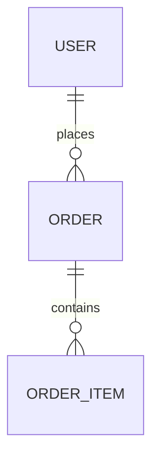
````

---

## Output Checklist

Before finalizing an ERD:

- [ ] All entities in UPPERCASE
- [ ] All fields in snake_case
- [ ] Primary keys marked with PK
- [ ] Foreign keys marked with FK
- [ ] Unique constraints marked with UK
- [ ] Relationships have cardinality symbols
- [ ] Relationships have descriptive labels
- [ ] Junction tables for many-to-many relationships
- [ ] Timestamps (created_at, updated_at) on all entities
- [ ] No plural entity names
- [ ] Diagram renders correctly in Mermaid Live Editor

---

## Summary

**Key Principles:**
1. Entities = UPPERCASE singular nouns
2. Fields = snake_case with type and constraints
3. Relationships = correct cardinality + descriptive label
4. Many-to-many = always use junction table
5. ERDs are living documents - update with schema changes
