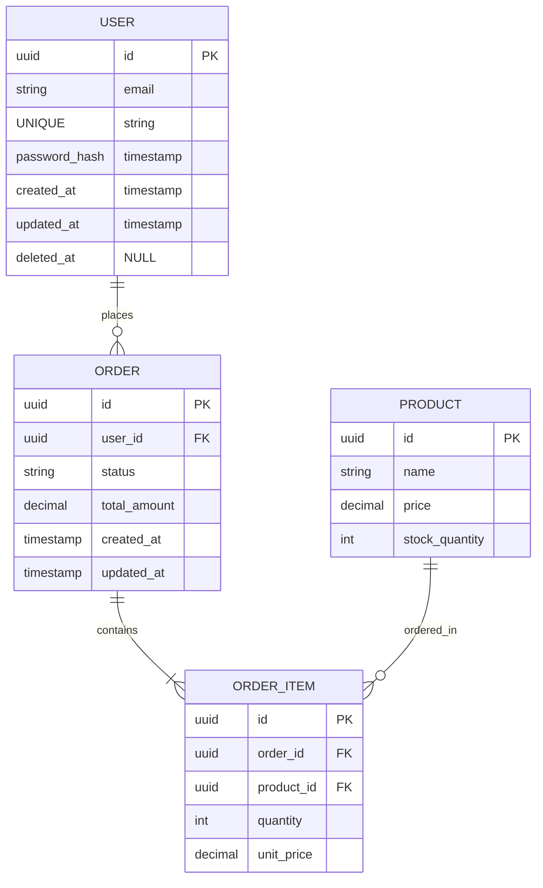

## Steps

### Step 1: Gather requirements with targeted questions

**Purpose:** Understand data needs, access patterns, and constraints before designing schema

**Questions to Ask:**

1. **Core Entities and Relationships:**
   - What are the main entities/tables needed?
   - How do they relate to each other (one-to-one, one-to-many, many-to-many)?
   - Are there hierarchical or self-referential relationships?

2. **Query Patterns:**
   - What are the most common read operations?
   - What are the most common write operations?
   - Are reads or writes more frequent?
   - What joins will be performed most often?

3. **Data Lifecycle:**
   - Are there soft-delete requirements (keep deleted records)?
   - Is an audit trail needed (who/when modified)?
   - Do we need versioning (track changes over time)?
   - What is the data retention policy?

4. **Scale and Performance:**
   - Expected row counts per table?
   - Expected request volume (reads/writes per second)?
   - Geographic distribution (multi-region)?
   - Performance SLAs (response time requirements)?

**Output:** Clear understanding of requirements to inform design decisions

---

### Step 2: Design complete schema with all artifacts

**Purpose:** Create comprehensive schema design with entities, relationships, indexes, and optimizations

**Artifacts to Produce:**

1. **Entity Definitions:**
   - Table name (snake_case)
   - All fields with:
     - Type (uuid, string, int, timestamp, etc.)
     - Nullability (NOT NULL vs nullable)
     - Defaults (NOW(), uuid_generate_v4(), etc.)
     - Constraints (UNIQUE, CHECK, foreign keys)
   - Primary key designation (PK)
   - Foreign key relationships (FK)

2. **Relationship Diagram:**
   - Use Mermaid ERD format (see Step 3)
   - Show all entities and their relationships
   - Include cardinality (one-to-one, one-to-many, many-to-many)
   - Label relationship names

3. **Index Recommendations:**
   - Based on stated query patterns
   - Include composite indexes for common multi-column queries
   - Note covering indexes for read-heavy queries
   - Flag foreign keys that need indexes

4. **Denormalization/Caching Strategy:**
   - Identify candidates for denormalization (reduce joins)
   - Suggest computed columns or materialized views
   - Recommend caching strategies with TTL
   - Provide rationale for each optimization

5. **Migration Skeleton:**
   - Up migration (create tables, indexes, constraints)
   - Down migration (rollback changes)
   - Note any data migration needs
   - Flag potential locking or downtime concerns

6. **Open Questions and Tradeoffs:**
   - Design decisions that need user input
   - Tradeoffs between normalization and performance
   - Potential future scaling challenges
   - Alternative approaches considered

**Example Entity Definition:**
```
users table:
- id: uuid, PK, DEFAULT uuid_generate_v4(), NOT NULL
- email: varchar(255), UNIQUE, NOT NULL
- password_hash: varchar(255), NOT NULL
- created_at: timestamp, DEFAULT NOW(), NOT NULL
- updated_at: timestamp, DEFAULT NOW(), NOT NULL
- deleted_at: timestamp, NULL (soft delete)

Index: idx_users_email ON users(email) (for login queries)
Index: idx_users_deleted_at ON users(deleted_at) WHERE deleted_at IS NULL (partial index)
```

**Output:** Complete schema design ready for review

---

### Step 3: Document design with diagrams and rationale

**Purpose:** Create visual representation and explain design decisions

**Mermaid ERD Format:**



**Relationship Notation:**
- `||--||` : One-to-one (exactly one)
- `||--o{` : One-to-many (zero or more)
- `||--|{` : One-to-many (one or more)
- `}o--o{` : Many-to-many (zero or more)

**Design Rationale Documentation:**

For each design decision, explain:
- **Why this approach?** (aligns with query patterns, reduces joins, etc.)
- **What alternatives were considered?** (normalization vs denormalization)
- **What are the tradeoffs?** (storage vs performance, complexity vs simplicity)

**Example:**
```
Decision: Soft-delete users with deleted_at timestamp

Why: Preserve user data for audit/compliance, allow order history to remain valid
Alternatives: Hard delete (lose data), archive table (adds complexity)
Tradeoffs: Queries must filter WHERE deleted_at IS NULL, but partial index keeps this efficient
```

**Output:** Clear documentation for reviewers and future maintainers

---

### Step 4: Get approval before implementation

**Purpose:** Ensure design meets requirements before writing code

**Rules:**

1. **No ORM code until approved:**
   - Present schema design only
   - Wait for explicit user sign-off
   - Don't generate model classes, repositories, or migrations yet

2. **Use database from Core Conventions:**
   - Check project's core-conventions.md for database choice
   - Use specified database's syntax and features
   - Don't assume PostgreSQL if project uses MySQL/MongoDB/etc.

3. **Approval checklist:**
   - [ ] All requirements addressed
   - [ ] Query patterns optimized
   - [ ] Indexes cover common queries
   - [ ] Migration strategy clear
   - [ ] Open questions resolved
   - [ ] User explicitly approves

**After Approval:**
- Generate ORM models
- Write migration files
- Implement repository layer
- Add validation logic

**Output:** Approved schema design ready for implementation

---

## Common Mistakes

❌ **Generating ORM code before approval**
- Problem: User may request changes, wasting implementation effort
- Solution: Wait for explicit approval of schema design

❌ **Missing indexes for foreign keys**
- Problem: Joins become slow, especially with large tables
- Solution: Always index foreign key columns

❌ **Not considering query patterns**
- Problem: Schema optimized for writes when reads dominate (or vice versa)
- Solution: Ask about read/write patterns first, design accordingly

❌ **Over-normalization**
- Problem: Too many joins slow down queries
- Solution: Strategic denormalization for hot paths, document tradeoffs

❌ **Ignoring soft-delete requirements**
- Problem: Hard deletes break referential integrity, lose audit trail
- Solution: Ask about deletion strategy, implement soft-delete if needed

❌ **Not planning for scale**
- Problem: Schema works at 1K rows but fails at 1M rows
- Solution: Ask about scale constraints, design indexes and partitioning accordingly

---

## Examples

### Example 1: E-commerce Schema Design

**Requirements:**
- Entities: users, products, orders, order_items
- Read-heavy: product browsing, order history
- Soft-delete: users and products
- Audit: order modifications
- Scale: 100K products, 1M users, 10M orders

**Design Highlights:**
```
products:
- Indexed on (category_id, price) for filtering
- Denormalize stock_quantity for fast reads (updated async)
- Soft-delete with deleted_at

orders:
- Indexed on (user_id, created_at DESC) for order history
- Audit fields: created_by, updated_by, updated_at
- Status enum with index for filtering

order_items:
- Composite index on (order_id, product_id) for fast joins
- Snapshot product price at order time (denormalized)
```

**Rationale:**
- Product browsing is read-heavy → optimize indexes for filtering
- Order history queries by user → index on (user_id, created_at)
- Price changes shouldn't affect past orders → denormalize unit_price in order_items

---

### Example 2: Multi-tenant SaaS Schema

**Requirements:**
- Entities: organizations, users, projects, tasks
- Multi-tenant: data isolation per organization
- Hierarchical: organizations → projects → tasks
- Scale: 10K orgs, 100K users, 1M tasks

**Design Highlights:**
```
All tables include:
- organization_id (FK, NOT NULL) for tenant isolation
- Composite indexes: (organization_id, <other_key>)

Row-level security (RLS):
- Enforce organization_id filtering at database level
- Prevent cross-tenant data leaks

Partitioning:
- Partition tasks by organization_id if orgs have very different sizes
```

**Rationale:**
- Multi-tenant → every query must filter by organization_id
- Composite indexes ensure tenant filtering is efficient
- RLS provides defense-in-depth security