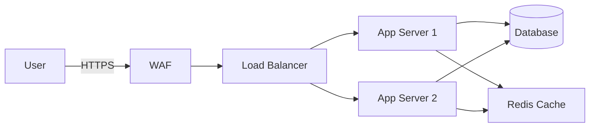

# Threat Modeling - Comprehensive Guide

## Overview

Threat modeling is a structured approach to identifying, quantifying, and addressing security risks in applications, systems, and business processes. It helps teams understand potential attack vectors, prioritize security efforts, and build defenses proactively rather than reactively.

## Prerequisites

### Knowledge Requirements
- Basic understanding of application architecture
- Familiarity with common attack patterns
- Understanding of risk assessment principles
- Knowledge of security controls and countermeasures

### Tools and Resources
- **Diagramming Tools**: Draw.io, Lucidchart, Microsoft Threat Modeling Tool
- **Frameworks**: STRIDE, PASTA, OCTAVE, Attack Trees
- **Risk Scoring**: DREAD, CVSS, FAIR
- **Documentation**: Confluence, GitHub Wiki, SharePoint

## Detailed Implementation Steps

### Step 1: Define Scope and Objectives

**1.1 Identify System Boundaries**
- Document what is in scope and out of scope
- Define trust boundaries between systems
- Identify external dependencies and integrations
- Map data flows across boundaries

**1.2 Gather Documentation**
- Architecture diagrams
- Network topology
- API specifications
- Security policies
- Compliance requirements

**1.3 Identify Stakeholders**
- Development teams
- Security teams
- Business owners
- Operations teams
- Compliance officers

### Step 2: Create Architecture Diagrams

**2.1 Data Flow Diagrams (DFD)**


**2.2 Component Identification**
- External entities (users, third-party services)
- Processes (applications, services)
- Data stores (databases, file systems)
- Data flows (network connections, API calls)

**2.3 Trust Boundary Mapping**
- Internet to DMZ
- DMZ to internal network
- Application to database
- User to application

### Step 3: Apply STRIDE Methodology

**3.1 Spoofing Identity**
- Threat: Attacker impersonates legitimate user
- Example: Stolen session tokens, weak authentication
- OWASP Reference: A07-2021 (Identification and Authentication Failures)
- Mitigation: Multi-factor authentication, secure session management

**3.2 Tampering with Data**
- Threat: Unauthorized modification of data
- Example: SQL injection, parameter manipulation
- OWASP Reference: A03-2021 (Injection)
- Mitigation: Input validation, integrity checks, parameterized queries

**3.3 Repudiation**
- Threat: User denies performing an action
- Example: Insufficient logging, lack of audit trail
- OWASP Reference: A09-2021 (Security Logging and Monitoring Failures)
- Mitigation: Comprehensive audit logging, digital signatures

**3.4 Information Disclosure**
- Threat: Exposure of sensitive information
- Example: Verbose error messages, directory traversal
- OWASP Reference: A01-2021 (Broken Access Control)
- Mitigation: Proper access controls, data encryption, error handling

**3.5 Denial of Service**
- Threat: System availability compromise
- Example: Resource exhaustion, infinite loops
- OWASP Reference: Related to availability concerns
- Mitigation: Rate limiting, resource quotas, circuit breakers

**3.6 Elevation of Privilege**
- Threat: Gaining unauthorized elevated access
- Example: Privilege escalation, insecure direct object references
- OWASP Reference: A01-2021 (Broken Access Control)
- Mitigation: Least privilege principle, role-based access control

### Step 4: Document Threats

**4.1 Threat Catalog Template**
```yaml
threat:
  id: THR-2024-001
  name: SQL Injection in User Login
  category: Tampering/Information Disclosure
  asset: User Authentication Service
  threat_agent: External Attacker
  attack_vector: Malicious SQL in username field
  vulnerability: Lack of input validation
  impact:
    confidentiality: High
    integrity: High
    availability: Medium
  likelihood: Medium
  risk_score: High (CVSS 8.5)
  mitigation:
    - Implement parameterized queries
    - Input validation and sanitization
    - Principle of least privilege for DB user
  status: Open
  owner: Security Team
  due_date: 2024-04-15
```

### Step 5: Risk Assessment and Prioritization

**5.1 DREAD Scoring**
- **D**amage: How bad would an attack be? (1-10)
- **R**eproducibility: How easy to reproduce? (1-10)
- **E**xploitability: How much work to exploit? (1-10)
- **A**ffected users: How many users impacted? (1-10)
- **D**iscoverability: How easy to discover? (1-10)

**5.2 Risk Matrix**
```
         Impact
    Low  Medium  High
L   P4    P3     P2
i   
k   P3    P2     P1
e
l   P2    P1     P1
i
h
o
o
d
```

### Step 6: Develop Mitigations

**6.1 Security Controls Mapping**
- Preventive controls (input validation, authentication)
- Detective controls (monitoring, alerting)
- Corrective controls (incident response, patching)
- Compensating controls (additional layers of defense)

**6.2 Implementation Priority**
1. Critical: Fix immediately (active exploitation possible)
2. High: Fix within sprint (significant risk)
3. Medium: Fix within quarter (moderate risk)
4. Low: Fix when convenient (minimal risk)

### Step 7: Validation and Testing

**7.1 Threat Model Review**
- Peer review by security team
- Developer validation of feasibility
- Business owner acceptance of residual risk

**7.2 Security Testing**
- Penetration testing of identified threats
- Vulnerability scanning
- Security test cases in QA

## Common Scenarios and Examples

### Scenario 1: Web Application Threat Model

**Assets**: User data, session tokens, API keys
**Threat Agents**: External attackers, malicious insiders
**Key Threats**:
- SQL injection (OWASP A03-2021)
- Cross-site scripting (OWASP A03-2021)
- Broken authentication (OWASP A07-2021)
- Sensitive data exposure (OWASP A02-2021)

### Scenario 2: API Threat Model

**Assets**: API endpoints, authentication tokens, business logic
**Threat Agents**: Unauthorized API consumers, attackers
**Key Threats**:
- Broken object level authorization (OWASP API1:2023)
- Broken authentication (OWASP API2:2023)
- Excessive data exposure (OWASP API3:2023)
- Rate limiting bypass (OWASP API4:2023)

### Scenario 3: Cloud Infrastructure Threat Model

**Assets**: Virtual machines, storage buckets, databases
**Threat Agents**: External attackers, compromised credentials
**Key Threats**:
- Misconfigured cloud storage (OWASP A05-2021)
- Inadequate IAM policies
- Unencrypted data at rest
- Network segmentation issues

## Best Practices

### Do's
- ✓ Update threat models with architecture changes
- ✓ Include threat modeling in design phase
- ✓ Involve diverse stakeholders
- ✓ Use standardized methodologies
- ✓ Document assumptions clearly
- ✓ Review and update regularly

### Don'ts
- ✗ Treat threat modeling as one-time activity
- ✗ Focus only on external threats
- ✗ Ignore business logic threats
- ✗ Skip threat model reviews
- ✗ Overcomplicate the process

## Integration with Security Programs

### Security Development Lifecycle (SDL)
- Requirements phase: Security requirements from threat model
- Design phase: Threat modeling sessions
- Implementation: Security controls from threat model
- Testing: Test cases from identified threats
- Deployment: Security monitoring for threats

### DevSecOps Integration
```yaml
# CI/CD Pipeline Integration
stages:
  - threat_model_check:
      script: validate_threat_model.py
      artifacts: threat_model.yaml
  - security_controls:
      script: verify_controls.py
      depends_on: threat_model_check
```

## Metrics and KPIs

### Threat Modeling Metrics
- Number of threats identified per component
- Percentage of threats with implemented mitigations
- Time to mitigation for critical threats
- Coverage: Systems with current threat models
- Review frequency and updates

### Success Indicators
- Reduction in security incidents related to modeled threats
- Faster identification of security issues in design
- Improved security awareness among developers
- Compliance with security requirements

## Common Pitfalls and Solutions

### Pitfall 1: Analysis Paralysis
**Problem**: Spending too much time on low-risk areas
**Solution**: Time-box activities, focus on high-value targets

### Pitfall 2: Generic Threats
**Problem**: Threats not specific to the system
**Solution**: Context-specific threat analysis, use real examples

### Pitfall 3: Stale Models
**Problem**: Threat models not updated with changes
**Solution**: Regular review cycles, version control integration

## Tools and Automation

### Microsoft Threat Modeling Tool
```powershell
# Generate threat model report
TMT7.exe /tm:MyApp.tm7 /report:HTML /output:threats.html
```

### OWASP Threat Dragon
- Open-source threat modeling tool
- Supports STRIDE methodology
- Integrates with GitHub

### PyTM (Python Threat Modeling)
```python
from pytm import TM, Server, Dataflow, Boundary

tm = TM("My Application")
internet = Boundary("Internet")
web_server = Server("Web Server")
db = Server("Database")

Dataflow(web_server, db, "User Data")
tm.process()
```

## References and Resources

- OWASP Top 10 2021
- OWASP API Security Top 10 2023
- STRIDE Threat Modeling (Microsoft)
- NIST SP 800-154: Guide to Data-Centric Threat Modeling
- SAFECode Tactical Threat Modeling
- ISO 27005: Information Security Risk Management

## Conclusion

Effective threat modeling is an iterative process that requires collaboration between security professionals, developers, and business stakeholders. By systematically identifying and addressing threats early in the development lifecycle, organizations can significantly reduce their security risk and build more resilient systems.